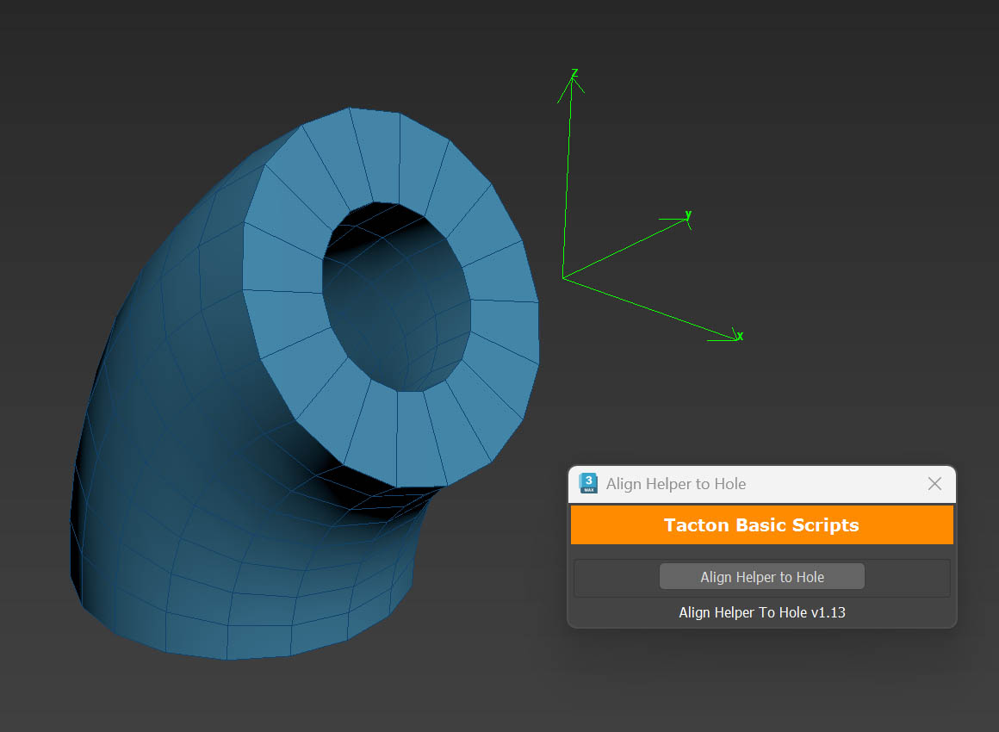
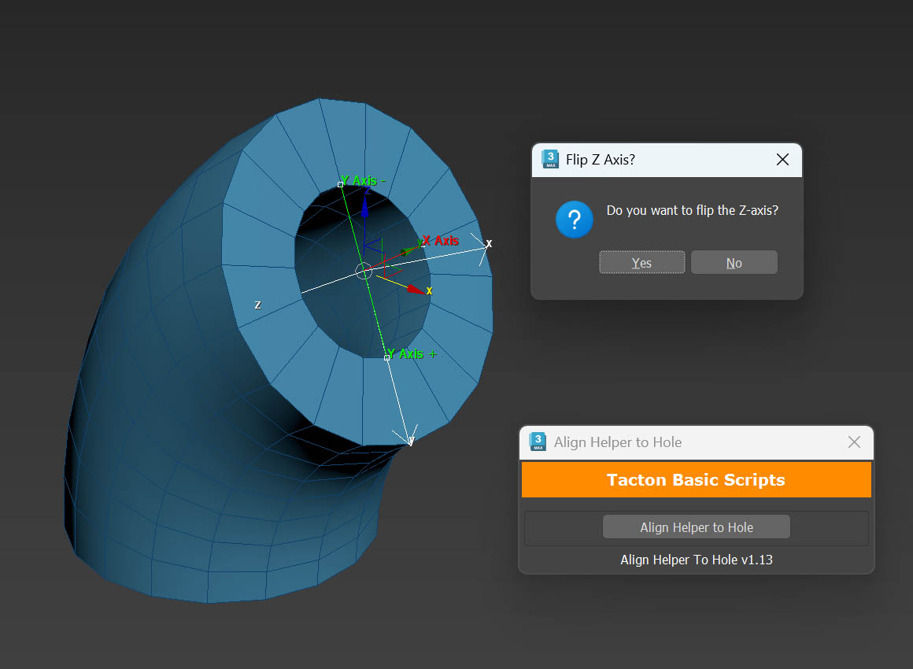

# Align Helper to Hole

Aligns a helper object to a hole using three point selections to define the Y and X axes.

> **Note:** This script is also available as a utility within [Docking Point Tools](../Docking%20Point%20Tools), which includes a separate button to flip the Z axis at any time.

## How to Use

**1.** Select the helper object you want to align to the hole.

**2.** Click two points along the hole's edge to define the Y axis — the first click sets **+Y**, the second sets **-Y**. The script finds the midpoint between them and aligns the helper's Y axis accordingly. Then click a third point on the hole's edge to align the **X axis**.

**3.** A dialog will appear asking **Flip Z Axis?**. If the Z axis is pointing in the wrong direction, select **Yes**.

**4.** The helper is now aligned to the hole.

