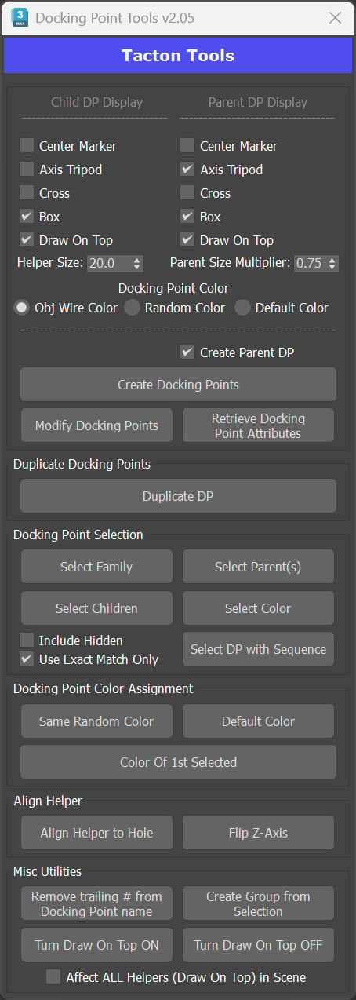

# Docking Point Tools

## Overview

Docking Point Tools is a collection of utilities specifically created for the creation, modification, organization, and duplication of Docking Points used for Tacton CPQ Visualization.

Docking Points in 3ds Max are helper objects named with the prefix `DP_`. This allows Tacton VIZstudio to identify them as Docking Points. Although `DP_` can be a prefix of any object or group, it is recommended to use only helpers when creating Docking Points.

## UI Groups

The script UI is organized into six groups:

1. **Create or Modify Docking Points** — Set visual appearance, create DPs from existing helpers or object pivots, modify appearance by prefix, and assign `P` or `C` sub-prefixes for parent/child designation (e.g. `DP_P_MyDockingPoint`).
2. **Duplicate Docking Points** — Instance selected DPs without adding a trailing `#` sequence, placed in the active layer and removed from any hierarchy.
3. **Docking Point Selection** — Select Parent(s), Children/Siblings, or entire Families from the currently selected DP(s). Also selects by color, and finds DPs with unwanted sequential `#` suffixes.
4. **Docking Point Color Assignment** — Sets the color of selected DPs. All DPs in the selection receive the same random color, or inherit the color of the first selected object.
5. **Align Helper** — Aligns a helper or DP to a hole and flips the Z-axis. Can align orientation to any 3 selectable or snappable points — midpoints, pivots, faces, edges, etc.
6. **Misc Utilities** — Miscellaneous helpers: remove `#` sequences from names, create groups using the pivot location and orientation of the first selected object, and toggle Draw On Top for all helpers in the scene.

---

## Usage

### 1. Create or Modify Docking Points

The recommended method is to start with a helper placed and oriented where the DP should be. An object or group's pivot can also be used as the DP location.

> **Note:** This processes every object in the selection individually. If **Create Parent DP** is checked, it creates two DPs per object. If a group is selected, it will cycle through every object within it. To use a group's pivot, open the group and select only the group head.

Set up the **Child DP Display** (left) and **Parent DP Display** (right) to your preference before creating. **Helper Size** sets the size of the Child DP. The Parent size is controlled by the **Parent Size Multiplier** — values above `1.0` make the Parent larger, below `1.0` smaller. It is recommended to keep the Child DP larger, as it will be manipulated more often when checking fit against Parent DPs.

With the desired helper or object selected, click **Create Docking Points**. A dialog will appear for each selected object to confirm or edit the name — you do not need to manually add `DP_C_` or `DP_P_` prefixes, these are added automatically. After confirmation, a Child DP named `DP_C_` will be created. If **Create Parent DP** is checked, a Parent DP named `DP_P_` will also be created at the same position.

> **Note:** If helpers already named `DP_C_` or `DP_P_` are in the selection, additional prefixes will not be added. If converting a helper named `DP_MyDockingPoint`, it will become `DP_C_MyDockingPoint` automatically.

To modify existing DPs, select them, configure the display settings, and press **Modify Docking Points**.

> **Note:** Only helpers with prefixes `DP_C_`, `DP_P_`, and `DP_DIM_` will be modified — other helpers in the selection are unaffected. `DP_DIM_` helpers take the display attributes of the Child DP Display. Dummy helper objects will not be modified.

**Retrieve Docking Point Attributes** copies the display settings of a selected DP into the UI spinners, which can then be used for creating or modifying other DPs.

> **Note:** When retrieving from a `DP_P_`, the Helper Size will reflect the current Parent Size Multiplier value.

---

### 2. Duplicate Docking Points

Instances selected DPs without adding a trailing `#` sequence to the name. Newly created DPs are placed in the currently active layer and removed from any hierarchy. Dummy helper objects with correctly named prefixes are also duplicated.

---

### 3. Docking Point Selection

With a DP selected, use this group to select its **Parents**, **Children/Siblings**, or entire **Family** based on the name following the `DP_P_` or `DP_C_` prefix.

**Example:** With `DP_C_EngineBlock` selected, clicking **Select Parent(s)** will select all helpers named `DP_P_EngineBlock`. If **Use Exact Match Only** is unchecked, it will also match `DP_P_EngineBlock_LowMount` or `DP_P_EngineBlock_002` — any additional characters at the end of the name are ignored when determining the match.
