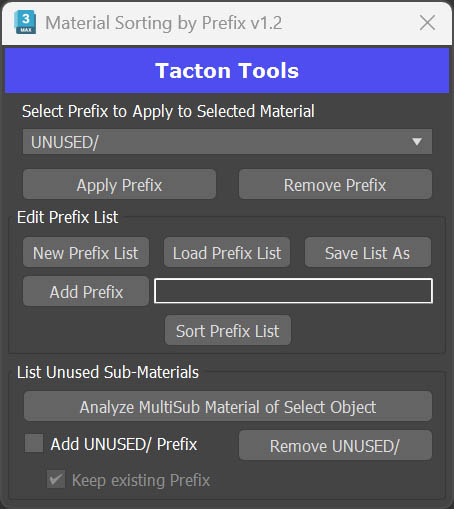
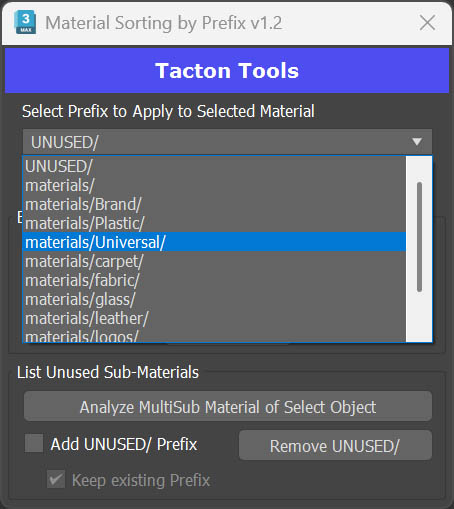

# Material Sorting by Prefix

Designed specifically for use with **Tacton VIZstudio**. Adds a folder directory prefix to the front of a material name so that when an object is imported via FBX, its materials are automatically sorted into organized folders.

## Prefix List

The prefix list is loaded from a `.txt` file in the same location the script is run from. A default list is provided in `SortingPrefixes_dropdownListItems.txt`.

You can manage prefix lists in several ways:
- **Load / Save** — Load lists for different projects or save your current list out to a `.txt` file.
- **Add Prefix** — Type a new prefix in the text field next to the **Add Prefix** button and press it to add it to the list.
- **Sort Prefix List** — Alphabetizes the current prefix list.
- Alternatively, edit `SortingPrefixes_dropdownListItems.txt` directly to predefine prefixes before launching the script.

## How to Use

Select a material in the **Slate Material Editor** or **Compact Material Editor**. Choose the desired prefix from the dropdown list and apply it. The prefix will be prepended to the material name.

## List Unused Sub-Materials

With a Multi/Sub-Object material applied to the currently selected object, this utility checks for any sub-materials not currently in use in the scene.

- **Add UNUSED/ Prefix** — When checked, the `UNUSED/` prefix is added to any unused sub-materials found.
- **Keep Existing Prefix** — Retains the existing prefix and prepends `UNUSED/` in front of it.
- **Remove UNUSED/** — Removes the `UNUSED/` prefix from the currently selected material only — it does not process all sub-materials in a Multi/Sub-Object material at once.

> **Note:** Use caution when **Add UNUSED/ Prefix** is checked, as it will modify all unused sub-materials in the selection.
