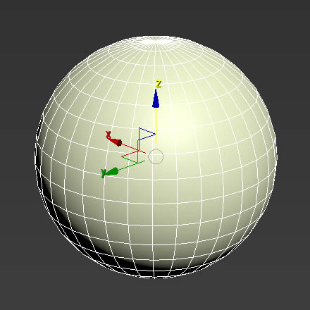
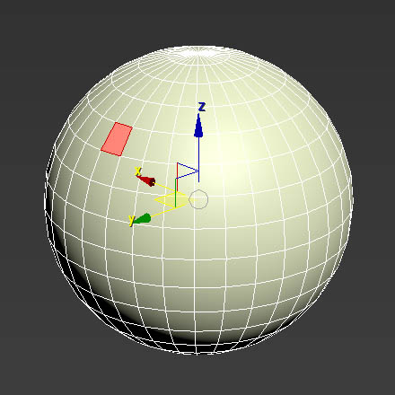
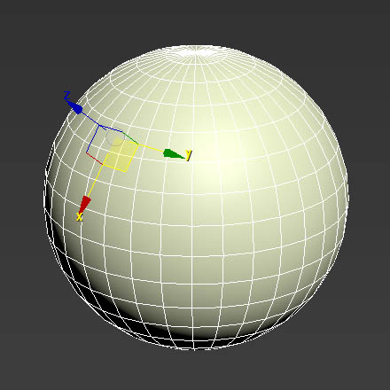

# Align Pivot to Face Normal

After installation, this tool can be found under **Toolbars** category > **Tacton Tools**.

## Overview

Align Pivot to Face Normal makes it easy to quickly align a **Working Pivot** to the center of a selected face. This does not change the original pivot location.

## How to Use

**1.** Select a **Face** or **Polygon** on your object.

**2.** Press **Align Pivot to Face**. The Working Pivot will snap to the center of the selected face, aligned to its normal.

## Resetting the Pivot

To return to normal:
1. In the **Hierarchy** tab, turn off **Use Working Pivot**.
2. Set the **Reference Coordinate System** from **Working** to **World**.
