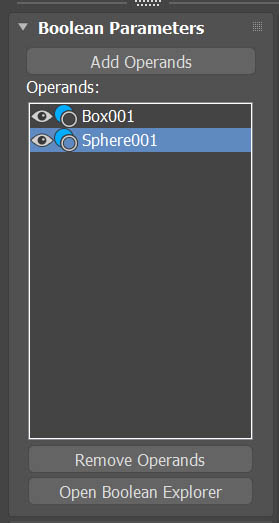
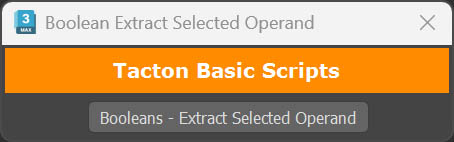
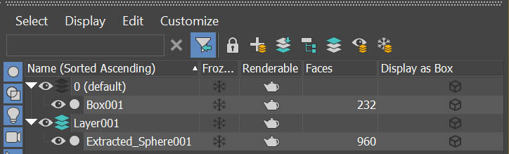

# Boolean_Extract Operand

After installation, this tool can be found under **Toolbars** category > **Tacton Tools**.

## Overview

The Boolean Compound Object in 3ds Max only offers the option to **Remove** operands, which deletes the object from the scene entirely. This is problematic when the operand was merged in, as its original object is no longer hidden in the scene.

**Extract Operand** solves this by creating an instance of the selected operand in the currently active layer, at the exact position and orientation it occupies within the Boolean Compound Object.

## How to Use

**1.** Within the Boolean Compound Object, select the operand you want to extract from the **Operands** list.

**2.** Press **Booleans - Extract Selected Operand**.

**3.** An instance of the operand is created in the currently active layer, in the exact position and orientation it held within the Boolean Compound Object.

