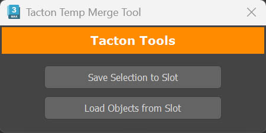

# Copy Paste

A clipboard-style utility for copying and pasting objects between 3ds Max scenes.

## TempMerge



### Save Selection to Slot

Saves the selected object(s) to a temporary `.max` file:

```
C:\Users\<username>\AppData\Local\Autodesk\3dsMax\2024 - 64bit\ENU\scripts\tmpMerge\tempSlot1.max
```

### Load Objects from Slot

Merges the objects from the saved slot file into the currently open `.max` scene.
